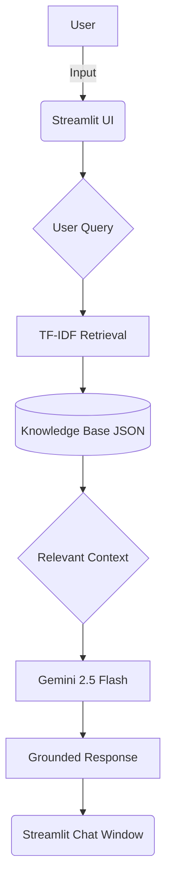

# DALEEL - Public service assistant 

## Execution Summary

Daleel  is a Retrieval-Augmented Generation (RAG) powered conversational assistant designed to help residents, tourists, and entrepreneurs understand UAE visa and licensing procedures.
The system provides guidance on eligibility, required documents, application processes, renewal procedures, and frequently asked questions through a conversational interface.
The assistant retrieves information from a curated local knowledge base and encourages users to verify information through official UAE government sources.

## Problem statement 

Users seeking information about UAE visas and licenses often need to navigate multiple government websites, understand complex requirements, and verify changing regulations. This process can be confusing, time-consuming, and prone to misinformation. As part of the UAE's vision to accelerate digital transformation and adopt AI-powered government services, there is a growing need for intelligent assistants that can provide reliable, personalized, and easily accessible guidance. A centralized AI-powered assistant can simplify access to trusted information, streamline service discovery, and enable users to verify information through official government sources. 

## Proposed Solution
DALEEL is an AI-powered assistant that helps users find information about UAE visas, licenses, and related government services through a simple chat interface.The assistant supports both English and Arabic, allowing users to interact in their preferred language 
Users can ask questions about eligibility requirements, required documents, application procedures, fees, processing times, and renewal processes. The assistant retrieves information from a curated knowledge base and generates responses based on the available information.
To help users verify information, the assistant also provides links to relevant official UAE government websites whenever available. By bringing information into one place and allowing users to ask questions in natural language, DALEEL makes it easier and faster to find guidance without searching through multiple websites.

## Key Benefits
* Centralized access to UAE government service information
* Simple conversational interface for asking questions
* Responses based on a curated knowledge base
* Reduced misinformation through official source verification
* Support for English and Arabic users
* Faster access to service-related information
* Direct links to official government websites for verification

## Overall Architecture

### Workflow:

1. User Query Input: Users ask questions through an intuitive Streamlit chat interface.
2. Information Retrieval Engine: The query is processed by a local TF-IDF retrieval engine, which searches our structured JSON knowledge base and identifies the most relevant information.
3. Context Grounding: Only the relevant content is extracted and provided to the AI model, reducing noise and ensuring responses are based on trusted government information.
4. AI Powered Response: The filtered context is sent to Gemini 2.5 Flash, which uses it as a grounding layer to generate reliable and service-specific answers.
5. Response Delivery: The final response is streamed back to the Streamlit chat interface, giving users a fast, conversational experience.

## Tools and Technologies Used
### Built With:
### Languages
Python
### Frameworks & Libraries
Streamlit — web application framework for the chat interface and UI
scikit-learn — TF-IDF (RAG component)
google-generativeai — official Python SDK for the Gemini API
### AI / LLM
Google Gemini API (gemini-2.5-flash) — conversational response generation, grounded via retrieval-augmented generation (RAG)
Retrieval-Augmented Generation (RAG) architecture — custom-built using TF-IDF retrieval over a curated knowledge base, rather than relying on the LLM's parametric knowledge alone
### Data
Custom-curated and normalized JSON knowledge base of UAE visa and license services, manually compiled and structured from publicly available UAE government service information (GDRFA, ICP, MOHRE, RTA, DED)
No external/live database used — version-controlled JSON file for this prototype
### Platforms & Hosting
Streamlit Community Cloud for application hosting and deployment
GitHub for version control and source code hosting

The system follows a Retrieval-Augmented Generation (RAG) approach. When a user submits a query, the retrieval engine searches the knowledge base for relevant information. The retrieved context is then provided to Gemini, which generates a grounded response based on the available information.

## Future Enhancements
### Renewal Reminders & Notifications
Send timely alerts for visa, Emirates ID, driving license, and business license renewals through email or mobile notifications.
### Location-Based Service Finder
Interactive map showing the nearest driving test centers, RTA offices, ICP/GDRFA centers, typing centers, and other relevant government service locations.
### Expanded Government Services
Extend support beyond visas and licenses to include Emirates ID services, family sponsorship, employment services, and business setup guidance.
### Real-Time Updates
Integrate with official government sources to provide the latest information on regulations, fees, and service requirements. 
### AI Analytics Dashboard
Analyze anonymous user queries to identify common information gaps, frequently requested services, and user pain points, helping improve public service delivery and user experience. 
## Conclusion
DALEEL demonstrates how AI can simplify access to government service information by providing a centralized, conversational platform for users seeking guidance on UAE visas, licenses, and related services. By combining a curated knowledge base with Retrieval-Augmented Generation (RAG) and Gemini AI, the assistant can provide quick and relevant answers while helping users verify information through official government websites. 
The project also supports the UAE's vision of using AI to improve digital services and enhance user experience. In the future, DALEEL can be expanded with additional services and proactive features, making it a more intelligent assistant that helps users throughout their government service journey. 
